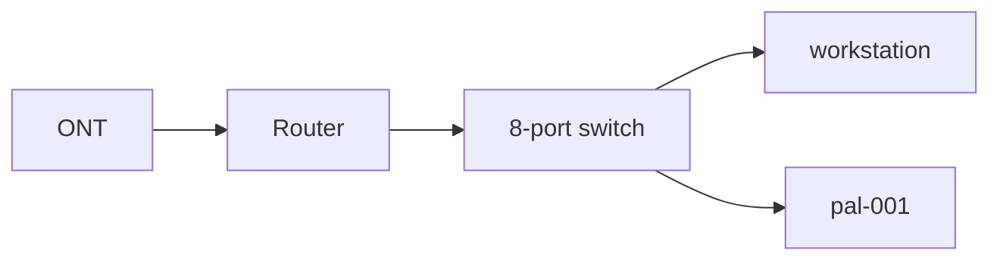

# homelab

Notes on my home lab. Hardware, network layout, and what's running on it.

## Network

```
Fiber -> ONT -> Router -> 8-port unmanaged switch
                            LAN 1  router uplink
                            LAN 2  workstation
                            LAN 3  pal-001
                            LAN 4-8  free
```

 Flat Net work Nothing forwarded from the WAN side yet. Planned: UDP 8211 to pal-001 for
Palworld. RCON (TCP 25575) and REST API (TCP 8212) stay closed..



## Hosts

### pal-001

Lenovo ThinkPad E15 Gen 2, running as the lab server.

| | |
| --- | --- |
| CPU | Intel i5-1135G7, 4C/8T, 2.4 GHz |
| RAM | 8 GB (7.0 GiB usable) (will add more soon) |
| Swap | 4 GB |
| Disk | 238.5 GB NVMe, LVM, 232 GB root |
| OS | Ubuntu Server 26.04.1 LTS, kernel 7.0.0-30 |
| Network | Onboard gigabit, wifi |

Notes:

- Installer only allocated 100 GB of the 235 GB volume group. Extended with
  `lvextend -l +100%FREE` and `resize2fs`.
- `systemd-networkd-wait-online.service` disabled. It blocked boot for over a
  minute with no configured interface.

Pending:

- Netplan config for the wired interface
- 1 TB SanDisk Extreme (SDSSDE70) as `/srv/data`, currently `sda`, unformatted
- Palworld dedicated server

### workstation

Daily driver.

| | |
| --- | --- |
| CPU | AMD Ryzen 5 5500, 3.6 GHz |
| GPU | NVIDIA RTX 2060 SUPER, 8 GB |
| RAM | 32 GB DDR4, going to 64 GB |
| Disk | 1.82 TB |
| OS | Windows 11, Kali Purple |

## Update — Home Server (pal-001)

**Hardware:** Lenovo ThinkPad E15 Gen 2 — Intel i5-1135G7 (4C/8T), 8GB RAM, 238GB NVMe

**OS:** Ubuntu Server 26.04.1 LTS

**Network:** ONT → router → 8-port switch → pal-001 (wired, static reservation planned)

**Status: server is up and running — Palworld dedicated server is live and reachable**

### Done
- Fresh Ubuntu Server install
- Fixed empty netplan config to bring up wired ethernet (enp4s0), replacing wifi-only setup
- SSH access confirmed from desktop
- Fixed lid-close behavior — closing the lid no longer suspends the machine (`/etc/systemd/logind.conf`)
- Locked down firewall with ufw — SSH restricted to LAN (192.168.0.0/16) only, all other inbound denied by default
- System fully updated
- Palworld dedicated server running and connectable

### Next
- Router hardening (disable UPnP, change admin password, set DHCP reservation for pal-001)
- Confirm UDP 8211 forward and firewall rule for Palworld specifically
- Docker migration for services (optional)
