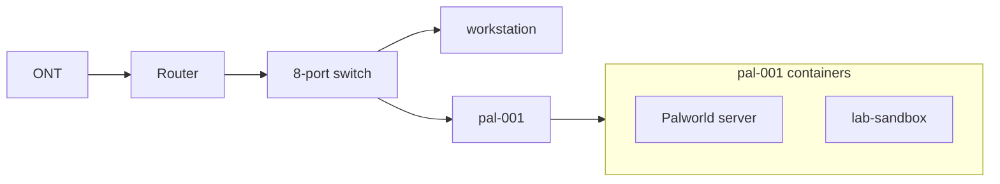

# homelab

Notes on my home lab — hardware, network layout, and what's running on it.

## Network

```
Fiber -> ONT -> Router -> 8-port unmanaged switch
                            LAN 1   router uplink
                            LAN 2   workstation
                            LAN 3   pal-001
                            LAN 4-8 free
```

Flat network. Nothing is forwarded from the WAN side yet. Planned: UDP 8211 to
pal-001 for Palworld. RCON (TCP 25575) and the REST API (TCP 8212) stay closed.

Firewall (pal-001): ufw enabled, SSH restricted to the LAN (192.168.0.0/16),
all other inbound denied by default.


```mermaid
flowchart LR
    ONT[ONT] --> RTR[Router]
    RTR --> SW[8-port switch]
    SW --> WS[workstation]
    SW --> SRV[pal-001]
    subgraph PALC[pal-001 containers]
        GAME[Palworld server]
        SBX[lab-sandbox]
    end
    SRV --> PALC
```

## Hosts

### pal-001

Lenovo ThinkPad E15 Gen 2, running as the lab server. Status: up, with the
Palworld dedicated server live and reachable.

| | |
| --- | --- |
| CPU | Intel i5-1135G7, 4C/8T, 2.4 GHz |
| RAM | 8 GB (7.0 GiB usable), adding more soon |
| Swap | 4 GB |
| Disk | 238.5 GB NVMe, LVM, 232 GB root |
| OS | Ubuntu Server 26.04.1 LTS, kernel 7.0.0-30 |
| Network | Onboard gigabit (wired, enp4s0) + wifi |

**Done**

- Fresh Ubuntu Server install
- Netplan config to bring up the wired interface (enp4s0), replacing the
  wifi-only setup; SSH from the desktop confirmed
- Extended the root volume — the installer only allocated 100 GB of the 235 GB
  volume group; fixed with `lvextend -l +100%FREE` and `resize2fs`
- Disabled `systemd-networkd-wait-online.service` (it blocked boot for over a
  minute with no configured interface)
- Lid-close no longer suspends the machine (`/etc/systemd/logind.conf`)
- Locked down the firewall with ufw — SSH restricted to the LAN, default deny
- System fully updated
- Services moved to Docker; Palworld dedicated server running and connectable
- lab-sandbox container environment up (see [Sandbox](#sandbox))

**Pending**

- Router hardening: disable UPnP, change admin password, set a DHCP reservation
  for pal-001
- Confirm the UDP 8211 forward and a Palworld-specific firewall rule
- 1 TB SanDisk Extreme (SDSSDE70) as `/srv/data`, currently `sda`, unformatted

### workstation

Daily driver.

| | |
| --- | --- |
| CPU | AMD Ryzen 5 5500, 3.6 GHz |
| GPU | NVIDIA RTX 2060 SUPER, 8 GB |
| RAM | 32 GB DDR4, going to 64 GB |
| Disk | 1.82 TB |
| OS | Windows 11 |

## Sandbox

`lab-sandbox` is an isolated container environment on pal-001 for testing and
tooling, kept separate from the game server. It runs under Docker and is bound
to the LAN interface only — it is not exposed to the WAN.
