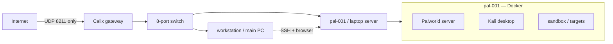

# homelab

Notes on my home lab — hardware, network layout, and what's running on it.

## Network

```
Fiber -> ONT -> Router -> 8-port unmanaged switch
                            LAN 1   router uplink
                            LAN 2   workstation
                            LAN 3   pal-001
                            LAN 4-8 free
```

Flat network. Only the Palworld game port is forwarded from the WAN side to
pal-001; all management ports (RCON, the REST API, SSH) stay LAN-only.

Firewall (pal-001): ufw enabled, SSH restricted to the LAN subnet, all other
inbound denied by default.

All the lab services run on pal-001 (the laptop). The workstation is the control
point — it runs no lab services itself; it's how everything on pal-001 is
reached, over the LAN, by SSH for the terminal and a browser for Kali's desktop
and the sandbox targets.


```mermaid
flowchart LR
    NET[Internet] -->|UDP 8211 only| RTR[Calix gateway]
    RTR --> SW[8-port switch]
    SW --> WS[workstation / main PC]
    SW --> SRV[pal-001 / laptop server]

    subgraph PALC[pal-001 — Docker]
        GAME[Palworld server]
        KALI[Kali desktop]
        SBX[sandbox / targets]
    end
    SRV --> PALC

    WS -. SSH + browser .-> SRV
```

## Hosts

### pal-001

Lenovo ThinkPad E15 Gen 2, running as the lab server. Status: up, with the
Palworld dedicated server live and reachable.

| | |
| --- | --- |
| CPU | Intel i5-1135G7, 4C/8T, 2.4 GHz |
| RAM | 8 GB (7.0 GiB usable), adding more soon |
| Swap | 4 GB |
| Disk | 238.5 GB NVMe, LVM, 232 GB root |
| OS | Ubuntu Server 26.04 LTS |
| Network | Onboard gigabit (wired) + wifi |

**Done**

- Fresh Ubuntu Server install
- Netplan config to bring up the wired interface, replacing the wifi-only
  setup; SSH from the desktop confirmed
- Extended the root volume — the installer only allocated 100 GB of the 235 GB
  volume group; fixed with `lvextend -l +100%FREE` and `resize2fs`
- Disabled `systemd-networkd-wait-online.service` (it blocked boot for over a
  minute with no configured interface)
- Lid-close no longer suspends the machine (`/etc/systemd/logind.conf`)
- Locked down the firewall with ufw — SSH restricted to the LAN, default deny
- System fully updated
- Services moved to Docker; Palworld dedicated server running and connectable
- Kali desktop running in a container (see [Kali](#kali))
- Sandbox for practice targets set up (see [Sandbox](#sandbox))
- Verified at the router: only UDP 8211 is forwarded to pal-001; DMZ disabled

**Pending**

- Router hardening: disable UPnP, change admin password, set a DHCP reservation
  for pal-001
- 1 TB SanDisk Extreme (SDSSDE70) as `/srv/data`, currently `sda`, unformatted

### workstation

Daily driver, and the control point for the lab — the machine used to reach
everything on pal-001 (SSH for the terminal, a browser for Kali's desktop and
the sandbox targets). It runs no lab services itself.

| | |
| --- | --- |
| CPU | AMD Ryzen 5 5500, 3.6 GHz |
| GPU | NVIDIA RTX 2060 SUPER, 8 GB |
| RAM | 32 GB DDR4, going to 64 GB |
| Disk | 1.82 TB |
| OS | Windows 11 |

## Kali

A Kali desktop runs in a container on pal-001 for security testing and tooling,
kept separate from the game server. It runs under Docker and is bound to the LAN
interface only — it is not exposed to the WAN, and is reached from the
workstation's browser over the home network, with its own login.

## Sandbox

A separate area on pal-001 for deliberately vulnerable practice targets, kept
apart from Kali and the game server. Targets run in their own containers, bound
to the LAN only and never exposed to the WAN, and are brought up only when in
use.
